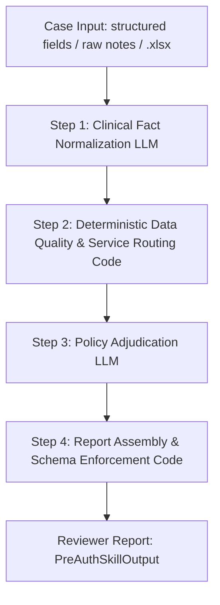

# PreAuthIQ — Deliverables & Core Expectations

This document provides a crystal-clear, comprehensive guide to all the **Suggested Deliverables** and technical design elements for the PreAuthIQ Prior-Authorization Copilot. 

---

## 📋 Deliverables Checklist & Quick Links

| Deliverable | Description / Links | Reference File |
| :--- | :--- | :--- |
| 📁 **GitHub Repository** | Monorepo containing both Backend & Frontend code bases.<br>🌐 [github.com/Anurag260704/PreAuthIQ](https://github.com/Anurag260704/PreAuthIQ) | [README.md](file:///c:/Users/ANURAG%20THAKUR/Documents/PLACEMENT%202025/REFERALS%20MAILS/GUSTO%20DEVELOPMENT/LOVE%20BABBAR%20DSA/PreAuthIQ/README.md) |
| ⚡ **Backend API** | REST API powered by FastAPI with interactive Swagger UI.<br>🚀 [preauthiq.onrender.com/docs](https://preauthiq.onrender.com/docs) | [api-reference.md](file:///c:/Users/ANURAG%20THAKUR/Documents/PLACEMENT%202025/REFERALS%20MAILS/GUSTO%20DEVELOPMENT/LOVE%20BABBAR%20DSA/PreAuthIQ/docs/api-reference.md) |
| 🖥️ **Frontend Interface** | Next.js visual dashboard, case upload, and report interface.<br>🎨 [pre-auth-iq.vercel.app](https://pre-auth-iq.vercel.app) | [ASSIGNMENT.md](file:///c:/Users/ANURAG%20THAKUR/Documents/PLACEMENT%202025/REFERALS%20MAILS/GUSTO%20DEVELOPMENT/LOVE%20BABBAR%20DSA/PreAuthIQ/docs/ASSIGNMENT.md) |
| 📄 **Complex Case Output** | Complete JSON result for the complex patient scenario (PA-001).<br>🔍 [complex_case_output.json](file:///c:/Users/ANURAG%20THAKUR/Documents/PLACEMENT%202025/REFERALS%20MAILS/GUSTO%20DEVELOPMENT/LOVE%20BABBAR%20DSA/PreAuthIQ/docs/examples/complex_case_output.json) | [SUBMISSION.md](file:///c:/Users/ANURAG%20THAKUR/Documents/PLACEMENT%202025/REFERALS%20MAILS/GUSTO%20DEVELOPMENT/LOVE%20BABBAR%20DSA/PreAuthIQ/SUBMISSION.md) |

---

## 1. GitHub Repository Structure

The code is structured as a monorepo, separating concern between the backend service, frontend application, and system documentation.

```text
PreAuthIQ/
├── backend/                  # FastAPI Web Server & Prior-Authorization Pipeline
│   ├── api/                  # API endpoints, middleware, and routers
│   ├── core/                 # Pipeline execution engine (Step 1-4 orchestrator)
│   ├── skill/                # LLM schemas, prompts, criteria templates, and assemblers
│   ├── data/                 # Sample cases (JSON) and Excel sheet parser outputs
│   └── tests/                # Automated pytest suite (validation, complex cases)
├── frontend/                 # Next.js Web Client
│   ├── app/                  # Pages: Dashboard, Case Selector, Manual Form, Report View
│   ├── components/           # UI Elements (EvidencePanel, RecommendationBanner, etc.)
│   └── services/             # API clients and hook integrations
├── docs/                     # Architectural design guides and API specs
└── outputs/                  # Static output logs for validation runs
```

---

## 2. Backend API to Test the Skill

The backend is built with FastAPI and runs a versioned REST API. You can test the endpoints locally or via the hosted service.

### 🌐 Hosted API Endpoints
- **API Swagger Documentation:** [https://preauthiq.onrender.com/docs](https://preauthiq.onrender.com/docs)
- **Base Endpoint:** `https://preauthiq.onrender.com/api/v1`

### 🛠️ Core API Endpoints

| Method | Endpoint | Description |
| :--- | :--- | :--- |
| `GET` | `/api/v1/status` | Connectivity/health check. |
| `GET` | `/api/v1/samples` | Retrieve pre-loaded workbook training cases. |
| `GET` | `/api/v1/samples/complex` | Fetch the structured input for the complex case (PA-001). |
| `POST` | `/api/v1/review` | Run the complete 4-step pipeline on a case payload. |
| `POST` | `/api/v1/review/upload` | Process prior-auth criteria directly by uploading a `.xlsx` case workbook. |

### 💻 How to Test via Curl (Complex Case Example)

1. **Retrieve the input payload** for the complex case (PA-001):
   ```bash
   curl "https://preauthiq.onrender.com/api/v1/samples/complex" -o case.json
   ```

2. **Send the payload to the pipeline** to obtain the clinical review:
   ```bash
   curl -X POST "https://preauthiq.onrender.com/api/v1/review" \
     -H "Content-Type: application/json" \
     -d @case.json
   ```

> [!NOTE]
> If a hosted backend cold start occurs, it may take 30-45 seconds for the Render free-tier instance to spin up.

---

## 3. Frontend Interface

The frontend is a modern Next.js client built with Tailwind CSS, supporting dark/light modes and designed for intuitive utilization review workflows.

- **Production URL:** [https://pre-auth-iq.vercel.app](https://pre-auth-iq.vercel.app)

### 🗺️ Frontend Routes & Pages

* **Landing page (`/`):** Summary of features, pipeline visual representation, and entry points.
* **Dashboard (`/dashboard`):** Overview of clinical data metrics, health checks, and a selection list of the 10 standard workbook training cases to run instantly.
* **Manual Input / Upload (`/review`):** Let users fill out custom patient records, paste clinical unstructured notes directly, or drop their `.xlsx` workbook files to trigger analysis.
* **Review Report (`/result`):** Renders the final `PreAuthSkillOutput` split into functional UI blocks:
  * **Gradient Status Banner:** Clear recommendation highlighting `LIKELY_APPROVE` (green), `NEED_MORE_INFO` (amber), or `LIKELY_DENY` (red) with confidence meters.
  * **Criteria Adjudication Table:** Expandable table displaying each payer policy requirement (MET / PARTIAL / UNMET / N/A).
  * **Evidence Panels:** Source-attributed text snippets extracted from notes or inputs.
  * **Actionable Gaps & Queries:** Text box generating precise templates for provider outreach.

---

## 4. Complex Case Output (PA-001)

The complex case input focuses on **cervical spondylotic myelopathy with radiculopathy** requiring cervical decompression and fusion. It features multiple conflicting source notes (PCP vs. Specialist) and incomplete latest surgical documentation regarding home ADL impacts and inpatient rationale.

- **Committed Output Path:** [complex_case_output.json](file:///c:/Users/ANURAG%20THAKUR/Documents/PLACEMENT%202025/REFERALS MAILS/GUSTO DEVELOPMENT/LOVE BABBAR DSA/PreAuthIQ/docs/examples/complex_case_output.json)

### 📊 Adjudication Rubric vs. Pipeline Outcome

| Criterion / Field | Expected Output (Excel Rubric) | Pipeline Output Outcome |
| :--- | :--- | :--- |
| **Recommendation** | `NEED_MORE_INFO` | `NEED_MORE_INFO` |
| **C1 (Imaging)** | `MET` | `MET` (MRI shows severe C5-C6 stenosis and cord compression) |
| **C2 (Neurologic Deficit)** | `MET` | `MET` (Resolves conflict in favor of specialist's positive Hoffmann/weakness exam) |
| **C3 (Conservative Trial)** | `MET` | `MET` (10 weeks of PT and epidural injections failed) |
| **C4 (Functional Impairment)** | `PARTIAL` | `PARTIAL` (ADLs present in PT notes but missing in latest surgeon note) |
| **C5 (Inpatient Site Justification)**| `PARTIAL` | `PARTIAL` (Surgeon note fails to state why outpatient care is unsafe despite BMI/OSA) |
| **C6 (Prerequisites)** | `PARTIAL` | `PARTIAL` (Outstanding documentation needed) |
| **Appeal Direction** | `null` | `null` (Clears appeal directions since this is a pending request, not a final denial) |
| **Flip Condition** | Populated | `"Likely approve once the latest surgeon note explicitly documents ADL limitations and inpatient site-of-care rationale."` |

---

## 5. Technical Approach & Architecture

### ⚙️ Deterministic 4-Step Pipeline

PreAuthIQ avoids single-stage conversational prompts in favor of a **deterministic, multi-stage state machine** that separates clinical extraction, policy evaluation, and result packaging.



1. **Step 1: Normalization (LLM):** Parses input into 30 structured fields. Extracts facts only, strictly using `null` for omitted items (no guessing). Captures document source/date.
2. **Step 2: Validation & Policy Routing (Code):** Computes an input data quality score. Evaluates keywords in `requested_service` to automatically map the patient to 1 of 7 customized payer policy templates.
3. **Step 3: Adjudication (LLM):** Evaluates patient facts against targeted policy criteria. Assigns per-criterion statuses (`MET`, `PARTIAL`, `UNMET`, `N/A`) and generates outreach letters. Computes QA audit scores.
4. **Step 4: Assembly (Code):** Validates Pydantic types. Enforces strict logical constraints (e.g. stripping `appeal_direction` for approvals or pendings; resolving criteria lists; overriding specific clinical conditions).

---

## 6. Prompt / Skill Design

The pipeline runs on **Mistral Large (`mistral-large-latest`)** using temperature `0.0` for deterministic outputs.

### 📌 Normalization Prompt (`NORMALIZATION_SYSTEM_PROMPT`)
- **Objective:** Pure clinical extraction and fact isolation.
- **Key Directive:** Rely strictly on inputs. Use `contradictory_flags` to record contradictory statements (e.g., General practitioner notes showing strength `5/5` vs specialist notes showing `4/5` grip).
- **Location:** [prompts.py](file:///c:/Users/ANURAG%20THAKUR/Documents/PLACEMENT%202025/REFERALS%20MAILS/GUSTO%20DEVELOPMENT/LOVE%20BABBAR%20DSA/PreAuthIQ/backend/skill/prompts.py)

### 📌 Evaluation Prompt (`EVALUATION_SYSTEM_PROMPT_TEMPLATE`)
- **Objective:** Policy validation and clinical adjudication.
- **Key Directive:** Inject criteria registries dynamically at runtime (using `.replace("{criteria_block}")` to avoid formatting issues with curly braces in policy texts).
- **Resolution Strategy:** Distinguish `PARTIAL` (clinical need exists but surgeon note lacks specific documentation) from `UNMET` (clinical data proves condition is missing). `PARTIAL` must map to `NEED_MORE_INFO`.
- **Location:** [prompts.py](file:///c:/Users/ANURAG%20THAKUR/Documents/PLACEMENT%202025/REFERALS%20MAILS/GUSTO%20DEVELOPMENT/LOVE%20BABBAR%20DSA/PreAuthIQ/backend/skill/prompts.py)

### 📌 Post-LLM Assembly Rules
- **Objective:** Pure Python safety wrapper.
- **Logical Alignment:** If the case is `LIKELY_APPROVE`, wipe `provider_query`, `flip_condition`, and `appeal_direction`.
- **Location:** [assembler.py](file:///c:/Users/ANURAG%20THAKUR/Documents/PLACEMENT%202025/REFERALS%20MAILS/GUSTO%20DEVELOPMENT/LOVE%20BABBAR%20DSA/PreAuthIQ/backend/skill/assembler.py)

---

## 7. Key Assumptions

* **Policy Availability:** Payer guidelines can be adequately represented via structured criteria sets (e.g. C1-C6).
* **Service Routing:** Procedure classification relies on keyword matching. First-match-wins resolve procedures to specific registries (Spine, Rehab, DME, Imaging, etc.), defaulting to a general template if no match is found.
* **Specialist Priority:** In adjudicating patient records, recent specialist documentation (e.g., neurologist/surgeon notes) takes precedence over older primary care records.
* **Input Language:** Unstructured case logs are written in clinical English.

---

## 8. Limitations

1. **LLM Non-Determinism:** Even at `temp=0.0`, API updates can result in minor phrasing changes (mitigated by strict validation testing).
2. **Procedural Coverage:** Procedural registry templates are limited to 7 core areas. Highly unique or rare cases receive a default template.
3. **No Direct EHR Integration:** Intake currently relies on form entry, raw copy/pasting, or `.xlsx` uploading.
4. **Processing Latency:** Processing a single case runs 2 separate LLM calls, totaling ~20-30 seconds.

---

## 9. Future Improvements

* **EHR Integration via FHIR:** Pull clinical case data directly from EHR systems to automate step 1.
* **RAG-based Policy Ingestion:** Use Retrieval-Augmented Generation to read PDF policies from commercial payers (e.g., Aetna, BCBS) instead of relying on hardcoded criteria registries.
* **Batch Processing Queue:** Run queues asynchronously overnight to process bulk prior-authorization lists.
* **Human-in-the-Loop Interventions:** Build a supervisor UI allowing clinical reviewers to manually adjust criterion verdicts before submitting the final authorization review.
