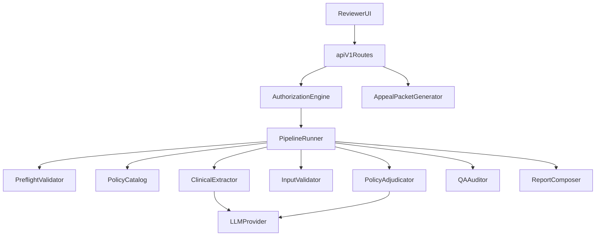

# PreAuthIQ Architecture

PreAuthIQ is a prior authorization review quality platform with explicit separation between API delivery, engine orchestration, deterministic validation/audit logic, and LLM-backed reasoning.

## Pipeline Flow

Deterministic steps run before LLM calls where possible:

1. **Preflight** — required fields and payload size checks (`core/validator.py`)
2. **Policy** — resolve service-specific criteria (`core/policy_catalog.py`)
3. **Extract** — LLM clinical field extraction with retry (`core/extractor.py`)
4. **Validate** — completeness scoring and enrichment hints (`core/validator.py`)
5. **Adjudicate** — LLM policy evaluation with retry (`core/adjudicator.py`)
6. **Audit** — deterministic QA metrics (`core/auditor.py`)
7. **Compose** — schema-safe report assembly (`core/composer.py`)

Orchestration lives in `backend/core/pipeline/` (`PipelineContext`, step wrappers, `PipelineRunner`).

## Core Modules

- `backend/core/engine.py`: thin wrapper around `PipelineRunner`.
- `backend/core/pipeline/`: step-based orchestration and timing instrumentation.
- `backend/core/extractor.py`: structured clinical extraction from mixed packet data.
- `backend/core/validator.py`: preflight checks, completeness scoring, and enrichment hints.
- `backend/core/adjudicator.py`: policy evaluation against service-specific rules.
- `backend/core/auditor.py`: deterministic QA scoring for consistency, contradiction risk, and appeal readiness.
- `backend/core/composer.py`: report normalization and schema-safe output assembly.
- `backend/core/llm_json.py`: shared LLM JSON parsing with one parse-retry per step.
- `backend/core/appeal.py`: structured appeal draft generation from adjudication outputs.
- `backend/core/providers.py`: LLM provider abstraction (`LLMProvider`, `MistralProvider`) with transient-error retry.

## API Layer

- `backend/main.py` initializes FastAPI and middleware.
- `backend/api/routes.py` hosts versioned `/api/v1/*` routes, including appeal packet generation.
- `backend/api/dependencies.py` centralizes auth + dependency injection.
- `backend/api/middleware.py` encapsulates CORS and request size controls.

## Design Rationale

- Preflight validation fails fast before any LLM call on invalid input.
- Policy resolution runs before extraction because it depends only on `requested_service`.
- The validator step runs before adjudication so poor packet quality is surfaced early.
- The auditor step runs after adjudication to produce explainable QA metrics independent of model randomness.
- Appeal packet generation is deterministic so downstream payer communication remains stable and reproducible.
- API versioning enables non-breaking evolution of endpoint contracts.
- Provider abstraction decouples orchestration from a single model vendor.
- Legacy `/api/*` aliases remain temporarily to ease migration.

## Legacy Skill Package

- `backend/skill/pipeline.py` delegates to `core.engine.run_engine` for backward compatibility.
- `backend/skill/assembler.py`, `prompts.py`, and `criteria_registry.py` remain the source of truth for output assembly and policy criteria.
